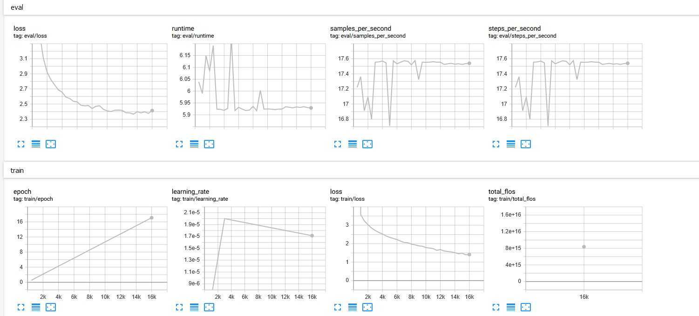

# ChatDr
This is a chat bot to answer questions about a patients' medical history. To use the model for inference, use the ChatDr_v1 file.
In the (current) 1.0 version I attempted to use a generative approach by fine-tuning gpt-2 (schedule trained on a local GPU with early stopping) on some patient history medical records (the code is commented to explain each step). The training succeeded in that it produces medical sounding text related to the prompt (usually about the condition for example). The training metrics were monitored using TensorBoard (image below). The model weights and configuration files are also uploaded here.

However it doesn't produce the relevant info related to the patient from the prompt.
In the 2.0 version (currently being trained) I take an extractive question answering approach (this will be uploaded when training is done), where given patient record/history as context, ChatDr will output the relevant answer from the context. The main challenge here was procuring a medical extractive QA dataset, I'm requesting access for an appropriate patient medical record dataset from Harvard School of Medicine.
In the meantime I used a model fine-tuned on SQuAD, then further finetuned specifically for scientific questions. The scientific QA dataset contained long context (longer than distilBERT max context size) in which case the context trianing data was sliced, and some of the contexts didn't contain the relevant answer, so this should serve to train the model to not answer questions if they are not in the context (similar to the SQuAD_v2 dataset).

